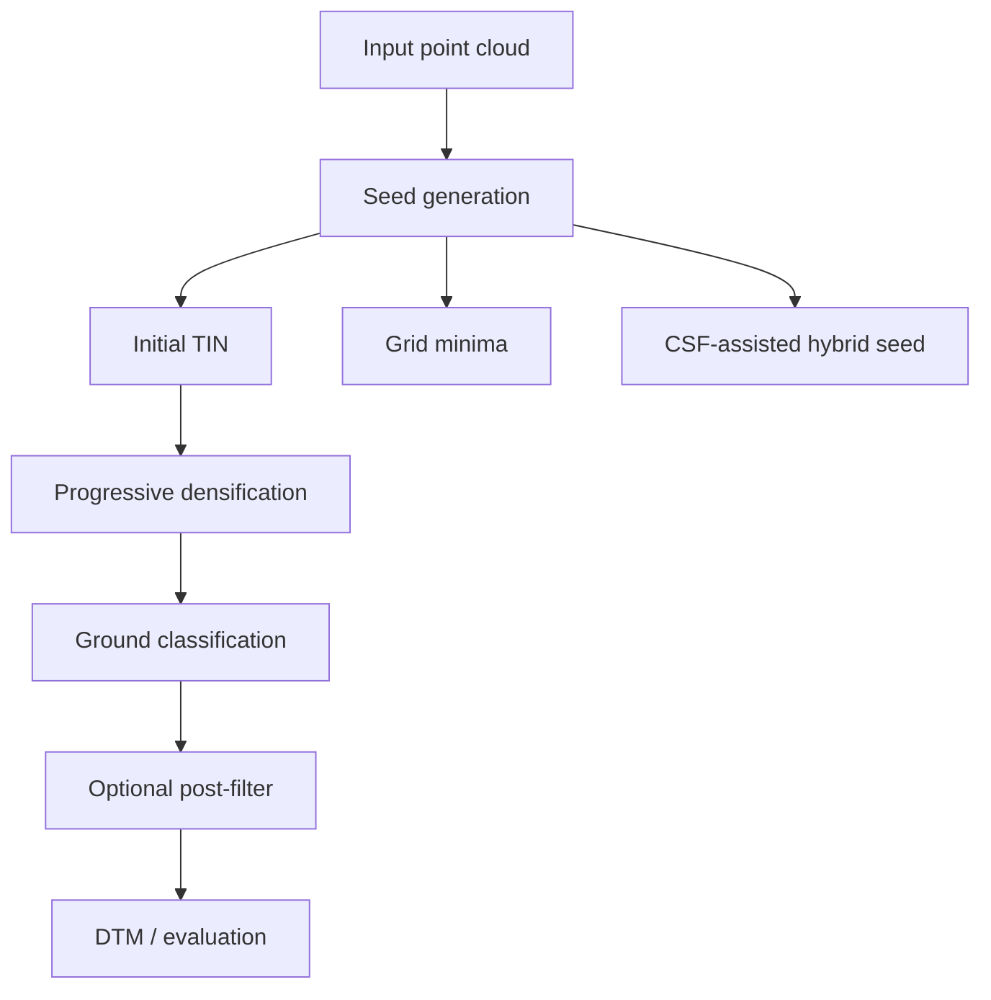

# Aerial Bare-Earth Experiment Log

Short English summary of one day of aerial LiDAR bare-earth experiments.

The implementation work happened in a separate private codebase. This repository only records what was tried, what moved the metrics, and what failed.

## Goal

Build a practical aerial LiDAR bare-earth pipeline for:

- ground / non-ground classification
- DTM generation
- later DEM-style production use

## Dataset

- Dataset: internal aerial LiDAR benchmark
- Labels: binary ground / non-ground supervision
- Split policy: fixed dev / validation / holdout split
- Known hard cases: dense urban tiles with roofs, elevated surfaces, and sharp terrain transitions

## Tested Pipeline

## What We Tried

### 1. Progressive TIN baseline

Baseline idea:

- coarse grid minima as seed
- initial TIN
- progressive densification
- classify by point-to-surface distance

Full-benchmark mean metrics:

| Method | Precision | Recall | F1 | IoU |
| --- | ---: | ---: | ---: | ---: |
| TIN baseline | 0.3470 | 0.8809 | 0.4890 | 0.3306 |

Takeaway:

- workable as a baseline
- main failure was urban false positives, not missing too much ground

### 2. Threshold and parameter sweeps

We tuned:

- `seed_resolution`
- `densify_resolutions`
- `iteration_distance`
- `classification_distance`
- `below_tolerance`
- `iteration_angle_deg`
- `terrain_angle_deg`

Takeaway:

- conservative settings killed recall too fast
- permissive settings kept roof / elevated-surface leakage
- this was not mainly a threshold problem

### 3. Generic post-filters

Added:

- local roughness rejection
- elevated-flat rejection with slope gate
- small island removal

Results:

| Method | Precision | Recall | F1 | IoU |
| --- | ---: | ---: | ---: | ---: |
| TIN baseline | 0.3470 | 0.8809 | 0.4890 | 0.3306 |
| roughness + islands | 0.3472 | 0.8871 | 0.4902 | 0.3317 |
| relief + slope guard | 0.3476 | 0.8356 | 0.4819 | 0.3238 |

Takeaway:

- filters worked technically
- practical gain was too small

### 4. Direct CSF comparison

Full-benchmark mean metrics:

| Method | Precision | Recall | F1 | IoU |
| --- | ---: | ---: | ---: | ---: |
| TIN baseline | 0.3470 | 0.8809 | 0.4890 | 0.3306 |
| CSF default | 0.3458 | 0.9470 | 0.4981 | 0.3391 |

Pooled class behavior:

| Method | Precision | Ground Acc | Non-Ground Acc | Overall Acc |
| --- | ---: | ---: | ---: | ---: |
| TIN baseline | 0.3444 | 0.8776 | 0.6935 | 0.7221 |
| CSF default | 0.3430 | 0.9457 | 0.6678 | 0.7109 |

Takeaway:

- CSF recovered more ground
- TIN rejected non-ground better
- CSF was useful, but not a full replacement

### 5. Hybrid seed: local minima intersected with CSF ground

Idea:

- run CSF on the full cloud
- keep only coarse local minima that also agree with CSF ground
- use that as the initial TIN seed

Full-benchmark mean metrics:

| Method | Precision | Recall | F1 | IoU |
| --- | ---: | ---: | ---: | ---: |
| TIN baseline | 0.3470 | 0.8809 | 0.4890 | 0.3306 |
| CSF default | 0.3458 | 0.9470 | 0.4981 | 0.3391 |
| Hybrid seed | 0.3483 | 0.8926 | 0.4923 | 0.3336 |

Pooled class behavior:

| Method | Precision | Ground Acc | Non-Ground Acc | Overall Acc |
| --- | ---: | ---: | ---: | ---: |
| TIN baseline | 0.3444 | 0.8776 | 0.6935 | 0.7221 |
| CSF default | 0.3430 | 0.9457 | 0.6678 | 0.7109 |
| Hybrid seed | 0.3458 | 0.8887 | 0.6916 | 0.7222 |

Takeaway:

- this was the first real improvement over pure TIN
- best current tradeoff
- `CSF as proposal, TIN as structure` was the useful pattern

### 6. Urban veto branch

Idea:

- keep the hybrid seed
- find cells where TIN says ground but CSF disagrees
- veto only elevated, flat, low-slope, coherent patches

Dev comparison:

| Variant | Precision | Recall | F1 | IoU |
| --- | ---: | ---: | ---: | ---: |
| Hybrid baseline | 0.4259 | 0.9246 | 0.5682 | 0.4085 |
| Urban veto a | 0.4259 | 0.9246 | 0.5681 | 0.4085 |
| Urban veto b | 0.4258 | 0.9242 | 0.5681 | 0.4084 |
| Urban veto b2 | 0.4239 | 0.9603 | 0.5738 | 0.4147 |
| Urban veto d | 0.4240 | 0.9598 | 0.5737 | 0.4147 |

Takeaway:

- first version barely changed anything
- stronger version changed behavior, but in the wrong direction
- precision went down while recall / F1 / IoU went up
- this branch behaved more like surface coverage recovery than roof rejection

## What Worked

- progressive TIN was a usable baseline
- CSF exposed a strong recall-oriented alternative
- hybrid seed initialization was the best result of the day

## What Did Not Work

1. treating the problem as mostly threshold tuning
2. expecting generic post-filters to fix urban roofs
3. assuming a late-stage urban veto would naturally improve precision

## Current Recommendation

Best current baseline:

- hybrid seed TIN pipeline
- not the urban veto branch

In short:

- use `coarse local minima ∩ CSF ground minima` for seed generation
- then run progressive TIN densification

## Next Step

Do not spend more time on late post-hoc vetoes first.

The next useful step is:

- detect elevated planar patches earlier
- reject them before they become final support geometry
- focus on the hardest dense urban tiles first

## Bottom Line

The day produced one clear improvement and several useful failures.

- Clear improvement: `CSF-assisted hybrid seed initialization`
- Useful failures: threshold-only tuning, generic cleanup filters, late urban veto

That is enough to narrow the next iteration considerably.
